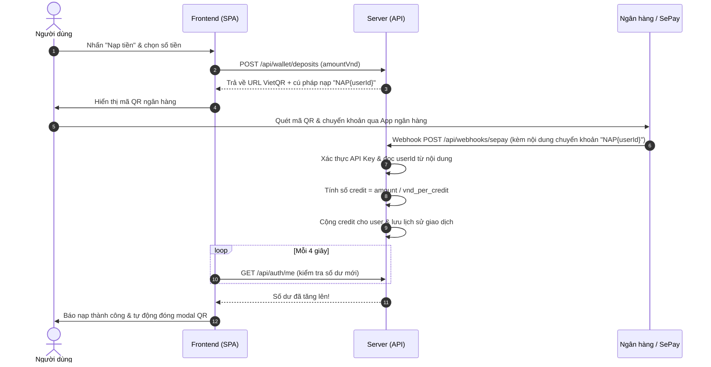

# 💎 Xưởng Nét — Nền Tảng SaaS Nâng Cấp Ảnh AI Tự Động

> **Xưởng Nét** là giải pháp SaaS hoàn chỉnh cho dịch vụ làm nét và phục chế ảnh bằng Trí Tuệ Nhân Tạo (AI Image Upscaling & Restoration). Dự án tích hợp đầy đủ hệ thống quản lý người dùng, ví credit trả phí, thanh toán chuyển khoản tự động qua VietQR/SePay/Pay2S, bảng điều khiển Admin kiểu WordPress và bộ công cụ sao lưu dữ liệu tự động.

---

## 📑 Mục lục

1. [Tổng quan dự án](#-tổng-quan-dự-án)
2. [Tính năng nổi bật](#-tính-năng-nổi-bật)
3. [Công nghệ sử dụng](#-công-nghệ-sử-dụng)
4. [Kiến trúc thư mục](#-kiến-trúc-thư-mục)
5. [Yêu cầu hệ thống](#-yêu-cầu-hệ-thống)
6. [Hướng dẫn cài đặt & Khởi chạy](#-hướng-dẫn-cài-đặt--khởi-chạy)
7. [Bảng biến môi trường (`.env`)](#-bảng-biến-môi-trường-env)
8. [Quy trình thanh toán & Webhook](#-quy-trình-thanh-toán--webhook)
9. [Cơ chế AI Upscale & Trừ Credit](#-cơ-chế-ai-upscale--trừ-credit)
10. [Hướng dẫn Bảng điều khiển Quản trị (Admin)](#-hướng-dẫn-bảng-điều-khiển-quản-trị-admin)
11. [Hệ thống Backup & Khôi phục tự động](#-hệ-thống-backup--khôi-phục-tự-động)
12. [Danh sách API Endpoints](#-danh-sách-api-endpoints)
13. [Kinh nghiệm triển khai Production](#-kinh-nghiệm-triển-khai-production)

---

## 🌟 Tổng quan dự án

Xưởng Nét được thiết kế theo tư duy tinh gọn (Lean Architecture) nhưng đáp ứng đầy đủ tiêu chuẩn thương mại hoá:
- **Phục vụ trọn gói (All-in-one):** Một tiến trình Node.js duy nhất vừa cung cấp REST API, vừa phục vụ trực tiếp Frontend Single-Page Application (SPA), không cần cài đặt hoặc build phức tạp.
- **Không phụ thuộc build-tool cồng kềnh:** Frontend chạy trực tiếp trên trình duyệt với Tailwind CSS CDN và Lucide Icons, tải trang tức thì.
- **Cơ sở dữ liệu SQLite Native:** Sử dụng trực tiếp module `node:sqlite` tích hợp sẵn trong Node.js (từ v22.5+), giải quyết triệt để vấn đề biên dịch C++ native khi cài đặt trên Windows/Linux.
- **Thanh toán tự động 24/7:** Tự động sinh mã VietQR theo cú pháp tĩnh của từng người dùng (`NAP{userId}`) và xác thực Webhook tức thì để cộng credit ngay khi tiền về tài khoản ngân hàng.

---

## ✨ Tính năng nổi bật

### 1. 🖼️ Nâng cấp ảnh AI (AI Image Upscaling)
- Tích hợp mô hình AI hàng đầu **Real-ESRGAN** (`nightmareai/real-esrgan`) thông qua Replicate API.
- Hỗ trợ tuỳ chọn nâng cấp độ phân giải **2x** hoặc **4x**.
- Tuỳ chọn **Face Enhance** (sử dụng GFPGAN) giúp phục chế khuôn mặt chi tiết, tự nhiên.
- Bộ so sánh tương tác trước/sau trực quan (Interactive Split Slider) ngay trên giao diện web.
- Tải ảnh kết quả độ phân giải cao chỉ với 1 click.
- Tích hợp thêm bộ giải thuật nâng cấp nhanh Canvas phía client (dùng thử nghiệm/miễn phí).

### 2. 💳 Hệ thống Ví Credit & Thanh toán Tự Động
- **Cơ chế tiền tệ Credit:** Quy đổi linh hoạt (ví dụ: 1.000 VNĐ = 1 Credit), có thể cấu hình động từ Admin.
- **Mã nạp tĩnh tối ưu (Stateless Deposits):** Mỗi người dùng sở hữu một mã nạp duy nhất dạng `NAP{userId}` (ví dụ: User #5 sẽ có mã `NAP5`).
- **Không rác cơ sở dữ liệu:** Không lưu trạng thái nạp "chờ" (pending) khi người dùng mở popup mà chưa chuyển tiền. Giao dịch chỉ được ghi nhận khi webhook ngân hàng xác nhận tiền thực tế đã vào tài khoản.
- **Quét mã VietQR tiện lợi:** Tự động tạo ảnh QR với số tiền và nội dung chuyển khoản chính xác thông qua chuẩn VietQR (`img.vietqr.io`).
- **Tự động nhận diện thanh toán:** Frontend tự động kiểm tra số dư và thông báo nạp thành công ngay khi tiền về, tự đóng modal.
- **Hỗ trợ cổng thanh toán:**
  - **SePay** (Webhook API Key bảo mật, đã kiểm chứng).
  - **Pay2S** (Khung tích hợp đối soát IPN).

### 3. 🔐 Tài khoản & Bảo mật
- Đăng ký, đăng nhập bảo mật với mật khẩu được mã hóa bằng **bcryptjs**.
- Xác thực phiên làm việc bằng **JWT (JSON Web Token)** lưu trong `httpOnly cookie`, chống rò rỉ qua XSS.
- Tự động gán quyền **Admin** cho các email khai báo trong biến môi trường `ADMIN_EMAILS`.

### 4. 🎛️ Bảng điều khiển Admin (Kiểu WordPress)
Giao diện quản trị hiện đại, phân chia tab trực quan không gây rối mắt:
- **Thống kê (Dashboard):** Tổng số user, tổng doanh thu VNĐ, tổng credit đã phát hành, tổng credit đã tiêu thụ, số lượt xử lý AI trong ngày.
- **Cấu hình giá (Settings):** Cập nhật ngay lập tức tỷ giá VNĐ/Credit, phí Credit cho mỗi lượt nâng cấp AI, và mức nạp tối thiểu mà không cần khởi động lại server.
- **Người dùng (Users):** Danh sách người dùng, vai trò, ngày tạo và công cụ **cộng/trừ credit thủ công** trực tiếp.
- **Giao dịch (Transactions):** Lịch sử nạp tiền và biến động số dư đã hoàn thành.
- **Lượt dùng AI (Usage Logs):** Nhật ký xử lý ảnh, trạng thái tác vụ và lượng credit đã tiêu thụ.

### 5. 🎨 Giao diện & Trải nghiệm người dùng (UX/UI)
- **Mặc định chế độ Sáng (Light mode)** trang nhã, hiện đại.
- **Chuyển đổi giao diện Sáng/Tối (Dark/Light Mode):** Tối giản với biểu tượng Lucide Icon, lưu trạng thái vào `localStorage`.
- **Tối ưu SEO toàn diện:** Hỗ trợ thẻ meta title, description, OpenGraph (`og:image`, `og:title`), Twitter Cards, favicon SVG và semantic HTML.

---

## 🛠️ Công nghệ sử dụng

| Lớp (Layer) | Công nghệ / Thư viện | Vai trò |
|---|---|---|
| **Runtime** | [Node.js](https://nodejs.org/) (≥ v22.5.0) | Môi trường thực thi JavaScript |
| **Backend Framework** | [Express.js](https://expressjs.com/) v4 | Xây dựng API và Router |
| **Cơ sở dữ liệu** | `node:sqlite` (SQLite Native) | Quản lý CSDL tốc độ cao với chế độ WAL (Write-Ahead Logging) |
| **Mã hóa & Xác thực** | `jsonwebtoken`, `bcryptjs`, `cookie-parser` | Bảo mật tài khoản, xác thực phiên |
| **AI Inference** | [Replicate API](https://replicate.com/) | Xử lý mô hình Real-ESRGAN trên GPU Cloud |
| **Thanh toán & QR** | [VietQR](https://vietqr.io/), [SePay](https://sepay.vn/), [Pay2S](https://pay2s.vn/) | Tạo QR Code và nhận Webhook ngân hàng |
| **Frontend** | HTML5, Vanilla JavaScript, Tailwind CSS CDN | Giao diện người dùng Single Page Application |
| **Biểu tượng** | [Lucide Icons](https://lucide.dev/) | Hệ thống icon đồ hoạ vector sắc nét |
| **Sao lưu dữ liệu** | Bash, SQLite Vacuum Snapshot, Rclone / GDrive API | Tự động hóa backup định kỳ lên đám mây |

---

## 📂 Kiến trúc thư mục

```text
upscale/
├── README.md                      # Tài liệu dự án chi tiết
├── public/                        # Frontend tĩnh (được Express phục vụ trực tiếp)
│   ├── favicon.svg                # Icon website
│   ├── index.html                 # Ứng dụng SPA (Trang chủ, Upscaler, Modal nạp tiền, Admin Dashboard)
│   └── og-image.jpg               # Ảnh thumbnail preview chia sẻ mạng xã hội (OpenGraph)
│
└── server/                        # Mã nguồn Backend
    ├── .env.example               # Mẫu khai báo cấu hình môi trường
    ├── .env                       # File cấu hình thực tế (không commit lên Git)
    ├── package.json               # Danh sách dependencies và lệnh khởi chạy
    ├── data.sqlite3               # File cơ sở dữ liệu SQLite (tự sinh khi khởi động)
    ├── src/
    │   ├── server.js              # Điểm khởi đầu của ứng dụng (Express app & static serving)
    │   ├── db.js                  # Khởi tạo Schema SQLite, định nghĩa các hàm truy vấn
    │   ├── auth.js                # Middleware xác thực JWT, hash mật khẩu, kiểm tra quyền Admin
    │   ├── routes/
    │   │   ├── auth.js            # API Đăng ký, đăng nhập, đăng xuất, lấy thông tin cá nhân
    │   │   ├── wallet.js          # API lấy số dư, tạo mã nạp tiền VietQR, lịch sử giao dịch
    │   │   ├── webhooks.js        # Nhận Webhook chuyển khoản SePay & Pay2S, cộng credit tự động
    │   │   ├── upscale.js         # API kết nối Replicate, chạy Real-ESRGAN và trừ credit
    │   │   └── admin.js           # API Quản trị: thống kê, cấu hình giá, quản lý người dùng
    │   └── payments/
    │       ├── vietqr.js          # Sinh URL ảnh VietQR thanh toán chuẩn
    │       ├── sepay.js           # Kiểm tra chữ ký và phân tích payload webhook từ SePay
    │       └── pay2s.js           # Module tích hợp IPN từ cổng Pay2S
    └── scripts/
        └── backup/                # Bộ công cụ sao lưu dữ liệu tự động
            ├── README.md          # Hướng dẫn thiết lập backup chi tiết
            ├── backup.sh          # Script tạo snapshot an toàn & đẩy lên Google Drive qua rclone
            ├── restore.sh         # Script hỗ trợ khôi phục database từ bản backup
            ├── snapshot.js        # Script Node.js snapshot SQLite không gây khóa DB
            └── backup-gdrive-node.js # Phương án upload Drive qua Service Account (không cần rclone)
```

---

## 💻 Yêu cầu hệ thống

1. **Node.js:** Phiên bản **≥ 22.5.0** (bắt buộc vì dự án sử dụng module chuẩn `node:sqlite`).
2. **NPM:** Phiên bản 10.x trở lên đi kèm Node.js.
3. **Tài khoản nhà cung cấp dịch vụ:**
   - Tài khoản [Replicate](https://replicate.com/) để lấy `REPLICATE_API_TOKEN`.
   - Tài khoản ngân hàng Việt Nam (Vietcombank, MB, Techcombank,...) và mã BIN ngân hàng để tạo mã VietQR.
   - Tài khoản [SePay](https://my.sepay.vn/) hoặc [Pay2S](https://pay2s.vn/) để nhận webhook biến động số dư.

---

## 🚀 Hướng dẫn cài đặt & Khởi chạy

### Bước 1: Clone kho mã nguồn
```bash
git clone https://github.com/ThaiDuyKhang/upscale.git
cd upscale
```

### Bước 2: Cài đặt thư viện cho Server
```bash
cd server
npm install
```

### Bước 3: Tạo và chỉnh sửa file cấu hình `.env`
Sao chép file mẫu:
```bash
cp .env.example .env
```
Mở file `.env` bằng trình soạn thảo (VS Code, Notepad, Nano,...) và điền các thông số:
- `JWT_SECRET`: Đổi thành một chuỗi ký tự ngẫu nhiên dài để bảo mật phiên đăng nhập.
- `ADMIN_EMAILS`: Điền email cá nhân của bạn (khi đăng ký tài khoản bằng email này trên web, bạn sẽ tự động có quyền Admin).
- `REPLICATE_API_TOKEN`: Điền token lấy từ Replicate.
- `BANK_BIN`, `BANK_ACCOUNT_NUMBER`, `BANK_ACCOUNT_NAME`: Thông tin tài khoản nhận tiền nạp.
- `SEPAY_WEBHOOK_APIKEY`: Điền API Key bạn sẽ cấu hình trên SePay Dashboard.

### Bước 4: Khởi chạy Server
Chạy chế độ bình thường:
```bash
npm start
```
Hoặc chạy chế độ phát triển (tự reload khi thay đổi code):
```bash
npm run dev
```

### Bước 5: Truy cập ứng dụng
Mở trình duyệt và truy cập:
👉 **`http://localhost:8787`**

> **Lưu ý về SQLite:** Khi server chạy, bạn có thể thấy thông báo `ExperimentalWarning: SQLite is an experimental feature`. Đây là cảnh báo tiêu chuẩn của Node.js đối với module `node:sqlite` tích hợp và hoàn toàn an toàn để sử dụng.

---

## ⚙️ Bảng biến môi trường (`.env`)

| Tên biến | Bắt buộc | Mặc định | Mô tả chi tiết |
|---|:---:|:---:|---|
| `PORT` | Không | `8787` | Cổng HTTP mà server lắng nghe. |
| `JWT_SECRET` | **Có** | - | Chuỗi bí mật ký xác thực JWT cookie. Không dùng giá trị mặc định khi lên production. |
| `ADMIN_EMAILS` | **Có** | - | Danh sách email (cách nhau bởi dấu phẩy) tự động cấp quyền `admin` ngay khi đăng ký. |
| `REPLICATE_API_TOKEN` | **Có** | - | API Token lấy từ `https://replicate.com/account/api-tokens`. |
| `REPLICATE_MODEL` | Không | `nightmareai/real-esrgan` | Tên mô hình AI Upscale trên Replicate (dùng official model không cần version hash). |
| `BANK_BIN` | **Có** | - | Mã BIN ngân hàng nhận tiền (Tra cứu tại [vietqr.io](https://www.vietqr.io/danh-sach-ngan-hang-hien-thi-logo/)). Ví dụ: `970441`. |
| `BANK_ACCOUNT_NUMBER` | **Có** | - | Số tài khoản ngân hàng của bạn. |
| `BANK_ACCOUNT_NAME` | **Có** | - | Tên chủ tài khoản (viết hoa không dấu, ví dụ: `THAI DUY KHANG`). |
| `SEPAY_WEBHOOK_APIKEY` | Tùy chọn | - | Mã API Key bí mật để xác thực request gửi từ SePay. |
| `PAY2S_PARTNER_CODE` | Tùy chọn | - | Mã đối tác do Pay2S cấp. |
| `PAY2S_ACCESS_KEY` | Tùy chọn | - | Access Key từ cổng Pay2S. |
| `PAY2S_SECRET_KEY` | Tùy chọn | - | Chữ ký Secret Key từ cổng Pay2S. |
| `VND_PER_CREDIT` | Không | `1000` | Giá quy đổi khởi tạo: 1 credit = bao nhiêu VNĐ (Admin có thể đổi trên web sau đó). |
| `CREDITS_PER_UPSCALE` | Không | `5` | Số credit tiêu thụ cho mỗi ảnh AI upscale thành công. |
| `MIN_DEPOSIT_VND` | Không | `10000` | Số tiền nạp tối thiểu cho mỗi lần nạp (VNĐ). |
| `SIGNUP_BONUS_CREDITS` | Không | `0` | Số credit tặng miễn phí cho thành viên mới khi vừa đăng ký. |

---

## 💸 Quy trình thanh toán & Webhook

Dự án áp dụng luồng thanh toán chuyển khoản ngân hàng tự động hóa 100%:



### Hướng dẫn cấu hình cổng SePay
1. Đăng ký tài khoản tại [my.sepay.vn](https://my.sepay.vn) và liên kết tài khoản ngân hàng của bạn.
2. Tại menu **Công ty → Cấu hình chung → Cấu trúc mã thanh toán**: Đặt tiền tố thanh toán là `NAP`.
3. Tại menu **Tích hợp → Webhooks → Thêm Webhook**:
   - **URL nhận Webhook:** `https://your-domain.com/api/webhooks/sepay` (Lưu ý: SePay yêu cầu URL có HTTPS. Nếu thử nghiệm local, hãy sử dụng `ngrok` hoặc `cloudflared tunnel`).
   - **Sự kiện:** Chọn *Giao dịch tiền vào*.
   - **Kiểu bảo mật:** Chọn **API Key**.
   - **Giá trị API Key:** Điền chính xác chuỗi bạn đã đặt tại `SEPAY_WEBHOOK_APIKEY` trong file `.env`.
4. Dùng tính năng *Thanh toán thử* (Sandbox) trên SePay với nội dung dạng `NAP1` (với ID tài khoản test là 1) để kiểm tra luồng nạp tự động.

---

## 🧠 Cơ chế AI Upscale & Trừ Credit

1. **Gửi ảnh:** Người dùng tải ảnh lên hoặc dán URL ảnh, chọn độ phân giải nâng cấp (2x/4x) và tuỳ chọn làm nét mặt.
2. **Kiểm tra số dư:** Server kiểm tra số dư của tài khoản có đủ `credits_per_upscale` hay không. Nếu không đủ, từ chối ngay lập tức để tiết kiệm tài nguyên.
3. **Gọi AI Replicate:** Server gọi API của Replicate để tạo prediction với model `nightmareai/real-esrgan`.
4. **An toàn Credit:**
   - Credit **chỉ bị trừ** khi Replicate xử lý và trả về link ảnh kết quả thành công.
   - Nếu quá trình xử lý gặp lỗi (file hỏng, Replicate quá tải,...), hệ thống **hoàn toàn không trừ credit**, đảm bảo quyền lợi tối đa cho người dùng.
5. **Nhật ký sử dụng:** Mỗi lượt gọi đều được ghi lại vào bảng `usage_logs` để tiện theo dõi và đối soát.

---

## 👑 Hướng dẫn Bảng điều khiển Quản trị (Admin)

### Cách tạo tài khoản Admin đầu tiên
Hệ thống không tạo sẵn tài khoản admin mặc định để tránh nguy cơ bảo mật. Để có tài khoản admin:
1. Mở file `.env`, điền email của bạn vào biến:
   ```env
   ADMIN_EMAILS=emailcuaban@gmail.com
   ```
2. Khởi động server và vào trang web, bấm **Đăng ký** với đúng email trên.
3. Tài khoản của bạn sẽ tự động được gắn quyền `admin`. Menu **Admin** sẽ xuất hiện trên thanh điều hướng.

### Các chức năng trong Admin Dashboard (`/admin`)
- **Thống kê:** Nắm bắt tức thời các chỉ số kinh doanh quan trọng: doanh thu thực nhận, người dùng hoạt động, credit phát hành, số ảnh đã xử lý trong ngày.
- **Cấu hình giá:** Điều chỉnh trực tiếp tỷ giá nạp, phí cho mỗi ảnh và hạn mức nạp tối thiểu mà không cần chạm vào code hay file cấu hình server.
- **Quản lý người dùng:** Xem danh sách khách hàng và sử dụng công cụ điều chỉnh credit linh hoạt (ví dụ: gõ `10` để cộng thêm 10 credit thưởng, hoặc `-5` để trừ 5 credit).
- **Lịch sử giao dịch & Lượt dùng AI:** Xem lại toàn bộ biến động tài chính và nhật ký nâng cấp ảnh trong hệ thống.

---

## 💾 Hệ thống Backup & Khôi phục tự động

SQLite lưu trữ toàn bộ dữ liệu vào một file duy nhất `data.sqlite3`. Để bảo vệ an toàn số dư tài khoản của khách hàng, thư mục `server/scripts/backup` đã được trang bị sẵn giải pháp sao lưu:

### Phương pháp 1: Dùng Rclone + Google Drive (Khuyên dùng)
1. Cài đặt Rclone và cấu hình liên kết Google Drive với tên remote là `gdrive` (`rclone config`).
2. Vào thư mục script:
   ```bash
   cd server/scripts/backup
   cp .env.example .env
   bash backup.sh
   ```
3. Đặt lịch chạy tự động bằng Cron (ví dụ: mỗi 30 phút một lần):
   ```bash
   crontab -e
   # Thêm dòng sau:
   */30 * * * * cd /duong-dan-toi/upscale/server/scripts/backup && bash backup.sh >> backup.log 2>&1
   ```

### Phương pháp 2: Khôi phục dữ liệu khi cần thiết
Khi cần phục hồi từ bản sao lưu trên đám mây:
```bash
cd server/scripts/backup
bash restore.sh
```
Script sẽ cho phép bạn chọn bản sao lưu muốn khôi phục và hướng dẫn thay thế an toàn.

---

## 📡 Danh sách API Endpoints

### 1. Xác thực (`/api/auth`)
| Phương thức | Endpoint | Yêu cầu đăng nhập | Mô tả |
|---|---|:---:|---|
| `POST` | `/api/auth/register` | Không | Đăng ký tài khoản mới (`email`, `password`) |
| `POST` | `/api/auth/login` | Không | Đăng nhập tài khoản, trả về cookie JWT |
| `POST` | `/api/auth/logout` | Có | Đăng xuất và xóa cookie JWT |
| `GET` | `/api/auth/me` | Có | Lấy thông tin user hiện tại (ID, email, role, credits) |

### 2. Ví & Thanh toán (`/api/wallet`)
| Phương thức | Endpoint | Yêu cầu đăng nhập | Mô tả |
|---|---|:---:|---|
| `GET` | `/api/wallet/transactions` | Có | Lấy danh sách lịch sử nạp/trừ credit của user |
| `POST` | `/api/wallet/deposits` | Có | Tạo yêu cầu nạp tiền, nhận mã QR VietQR và cú pháp nạp |

### 3. Cổng Webhook (`/api/webhooks`)
| Phương thức | Endpoint | Xác thực | Mô tả |
|---|---|:---:|---|
| `POST` | `/api/webhooks/sepay` | API Key Header | Nhận thông báo biến động số dư từ SePay, cộng tiền tự động |
| `POST` | `/api/webhooks/pay2s` | Signature | Nhận IPN từ Pay2S, cộng tiền tự động |

### 4. AI Upscale (`/api/upscale`)
| Phương thức | Endpoint | Yêu cầu đăng nhập | Mô tả |
|---|---|:---:|---|
| `POST` | `/api/upscale` | Có | Gửi ảnh sang Replicate xử lý, trừ credit khi thành công |

### 5. Quản trị viên (`/api/admin` — Yêu cầu quyền Admin)
| Phương thức | Endpoint | Quyền hạn | Mô tả |
|---|---|:---:|---|
| `GET` | `/api/admin/stats` | Admin | Lấy các chỉ số thống kê tổng thể hệ thống |
| `GET` | `/api/admin/settings` | Admin | Lấy cấu hình giá hiện tại |
| `POST` | `/api/admin/settings` | Admin | Cập nhật cấu hình giá |
| `GET` | `/api/admin/users` | Admin | Lấy danh sách người dùng |
| `POST` | `/api/admin/users/:id/adjust` | Admin | Cộng hoặc trừ credit của một người dùng |
| `GET` | `/api/admin/transactions` | Admin | Lấy danh sách toàn bộ giao dịch trong hệ thống |
| `GET` | `/api/admin/usage` | Admin | Xem lịch sử các lượt gọi xử lý AI |

---

## 🛡️ Kinh nghiệm triển khai Production

Khi đưa dự án lên máy chủ thật (VPS / Cloud Server):

1. **Bắt buộc sử dụng HTTPS:**
   - Dùng Nginx, Caddy hoặc Cloudflare SSL làm Reverse Proxy đứng trước cổng `8787`.
   - Khi đã có HTTPS, vào file `server/src/auth.js`, mở chú thích dòng:
     ```javascript
     secure: true, // Chỉ truyền cookie qua kênh HTTPS bảo mật
     ```
2. **Quản lý tiến trình bằng PM2:**
   Cài đặt PM2 để server luôn tự khởi động lại khi crash hoặc khi reboot VPS:
   ```bash
   npm install -g pm2
   cd server
   pm2 start src/server.js --name "xuong-net"
   pm2 save
   pm2 startup
   ```
3. **Giới hạn tốc độ gọi (Rate Limiting):**
   Cân nhắc bổ sung `express-rate-limit` cho các endpoint nhạy cảm như `/api/auth/login`, `/api/auth/register` và `/api/upscale` để ngăn ngừa tấn công Brute-force mật khẩu hoặc spam API.
4. **Bật sao lưu tự động ngay từ ngày đầu:**
   Thiết lập lịch cron chạy `backup.sh` lên Google Drive để đảm bảo tài sản số dư của khách hàng luôn được an toàn tuyệt đối.

---

## 📄 Bản quyền & Đóng góp

- Phát triển bởi: **Thái Duy Khang**
- Giấy phép: [MIT License](LICENSE) — Bạn hoàn toàn tự do sử dụng, chỉnh sửa và triển khai cho mục đích cá nhân hoặc thương mại.
